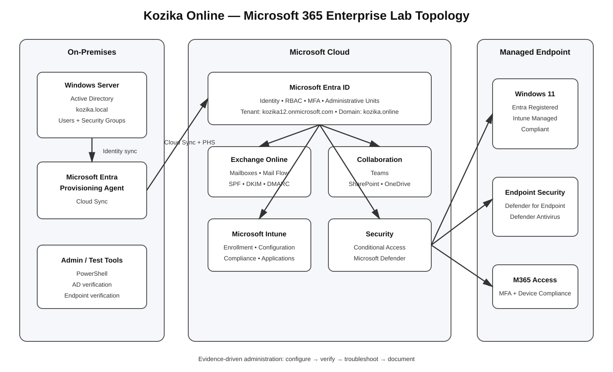

# Microsoft 365 Enterprise Lab

**Portfolio Priority: #5 — Microsoft 365 / Endpoint Administration**

A practical Microsoft 365 lab for **IT Infrastructure / Microsoft 365 Administration** using a small-company scenario.

## Environment

- Microsoft 365
- Microsoft Entra ID
- Windows Server / Active Directory
- Microsoft Entra Cloud Sync
- Exchange Online
- Microsoft Teams
- SharePoint Online
- OneDrive
- Microsoft Intune
- Conditional Access
- Microsoft Defender

## Architecture



The lab connects on-premises Active Directory to Microsoft Entra ID and extends identity into Exchange Online, collaboration services, Intune, Conditional Access, and endpoint security.

## Completed Tasks

| # | Area | Result |
|---|---|---|
| 01 | Tenant & organization setup | ✅ |
| 02 | Entra ID users & groups | ✅ |
| 03 | Entra administration & security | ✅ |
| 04 | Exchange Online & mailboxes | ✅ |
| 05 | Exchange mail flow & troubleshooting | ✅ |
| 06 | Microsoft Teams | ✅ |
| 07 | SharePoint Online | ✅ |
| 08 | OneDrive | ✅ |
| 09 | Intune device enrollment | ✅ |
| 10 | Intune configuration & compliance | ✅ |
| 11 | Intune application management | ✅ |
| 12 | Conditional Access | ✅ |
| 13 | Microsoft Defender | ✅ |

Detailed task documentation is available in [Documentation](Documentation/).

## Core Skills Demonstrated

### Identity
- Microsoft Entra ID
- Active Directory integration
- Cloud Sync
- Password Hash Synchronization
- Users and groups
- RBAC
- MFA
- Administrative Units

### Messaging
- Exchange Online mailboxes
- SMTP and aliases
- MX
- SPF, DKIM, DMARC
- Message Trace
- Mail-flow troubleshooting

### Endpoint Management
- Intune enrollment
- Configuration profiles
- Compliance policies
- Win32 applications
- Application troubleshooting
- Endpoint verification

### Security
- Conditional Access
- MFA
- Device compliance
- Sign-in logs
- Microsoft Defender
- Endpoint security

## Troubleshooting Method

```text
Problem
   ↓
Evidence
   ↓
Hypothesis
   ↓
Test
   ↓
Fix
   ↓
Verify
   ↓
Document
```

Examples include Cloud Sync scope problems, Exchange mail-flow issues, Intune application deployment, Conditional Access device identity, and Defender policy verification.

## PowerShell Scope

PowerShell was used for practical checks and administration where available.

Full Microsoft 365 PowerShell automation is **not completed** because the trial environment did not provide the required capability. This is intentionally not presented as a completed skill.

## Project Boundaries

This project does not claim advanced expertise in:

- Microsoft Graph automation
- SharePoint development / SPFx
- Microsoft Sentinel
- Advanced Defender for Cloud Apps
- Large migration projects
- Full Microsoft Purview implementation

## Result

**Identity → Messaging & Collaboration → Endpoint Management → Conditional Access → Endpoint Security**

The project demonstrates practical administration, verification, troubleshooting, and documentation rather than only configuration.
